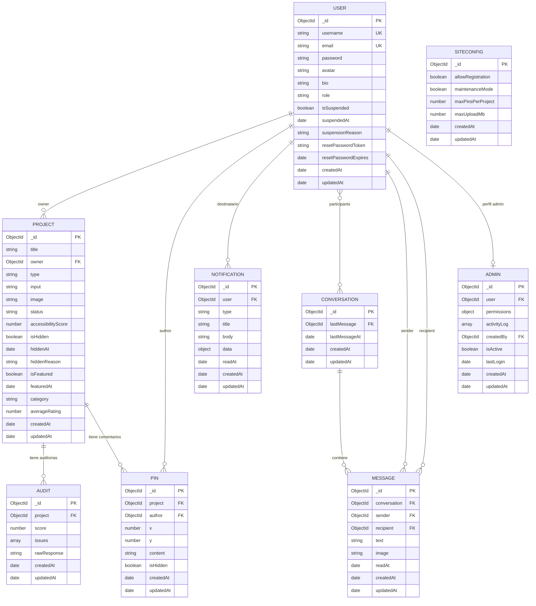

# Base de Datos — Axio

Axio utiliza **MongoDB** como base de datos NoSQL, gestionada con **Mongoose** como ODM (Object Document Mapper). La base de datos se llama `axio_db` y contiene **9 colecciones**.

---

## Índice de colecciones

| Colección | Modelo | Descripción |
|---|---|---|
| `users` | `User` | Usuarios registrados en la plataforma |
| `projects` | `Project` | Proyectos de accesibilidad subidos por los usuarios |
| `audits` | `Audit` | Resultados de auditoría generados por IA |
| `pins` | `Pin` | Comentarios colaborativos anclados sobre proyectos |
| `notifications` | `Notification` | Notificaciones en tiempo real para los usuarios |
| `conversations` | `Conversation` | Conversaciones de mensajería privada entre usuarios |
| `messages` | `Message` | Mensajes individuales dentro de una conversación |
| `admins` | `Admin` | Permisos y registro de actividad de administradores |
| `siteconfigs` | `SiteConfig` | Configuración global de la plataforma (singleton) |

---

## Esquemas detallados

### 1. `users`

Almacena todos los usuarios registrados. Es la colección central de la que dependen casi todas las demás.

| Campo | Tipo | Obligatorio | Descripción |
|---|---|---|---|
| `_id` | ObjectId | ✅ (auto) | Identificador único MongoDB |
| `username` | String | ✅ | Nombre de usuario único, mín. 3 chars |
| `email` | String | ✅ | Email único, normalizado en minúsculas |
| `password` | String | ✅ | Hash bcrypt, excluido por defecto de queries (`select: false`) |
| `avatar` | String | ❌ | Nombre del fichero de imagen del avatar |
| `bio` | String | ❌ | Descripción del perfil, máx. 65 caracteres |
| `role` | String (enum) | ✅ | `'user'` \| `'admin'`. Por defecto `'user'` |
| `isSuspended` | Boolean | ❌ | Si la cuenta está suspendida por un admin |
| `suspendedAt` | Date | ❌ | Fecha en que se suspendió la cuenta |
| `suspensionReason` | String | ❌ | Motivo de la suspensión |
| `resetPasswordToken` | String | ❌ | Token SHA-256 para reset de contraseña (`select: false`) |
| `resetPasswordExpires` | Date | ❌ | Fecha de expiración del token (1 hora) |
| `createdAt` | Date | ✅ (auto) | Timestamp de creación (Mongoose `timestamps`) |
| `updatedAt` | Date | ✅ (auto) | Timestamp de última modificación |

**Índices:** `username` (unique), `email` (unique)

---

### 2. `projects`

Cada proyecto representa un recurso subido por un usuario para ser auditado: una URL, un archivo o código fuente.

| Campo | Tipo | Obligatorio | Descripción |
|---|---|---|---|
| `_id` | ObjectId | ✅ (auto) | Identificador único |
| `title` | String | ✅ | Título del proyecto |
| `owner` | ObjectId → `users` | ✅ | Usuario propietario |
| `type` | String (enum) | ✅ | `'url'` \| `'file'` \| `'code'` |
| `input` | String | ✅ | URL o nombre del archivo subido |
| `image` | String | ❌ | Captura de pantalla o imagen de portada |
| `status` | String (enum) | ✅ | `'pending'` \| `'analyzed'` \| `'failed'` |
| `accessibilityScore` | Number | ❌ | Puntuación de accesibilidad (0–100) |
| `isHidden` | Boolean | ❌ | Si el proyecto está oculto por un admin |
| `hiddenAt` | Date | ❌ | Fecha de ocultación |
| `hiddenReason` | String | ❌ | Motivo de ocultación |
| `isFeatured` | Boolean | ❌ | Si el proyecto está destacado en la comunidad |
| `featuredAt` | Date | ❌ | Fecha en que se destacó |
| `tags` | String[] | ❌ | Etiquetas del proyecto |
| `category` | String | ❌ | Categoría del proyecto |
| `likes` | ObjectId[] → `users` | ❌ | Array de IDs de usuarios que dieron like |
| `ratings` | `[{user, value}]` | ❌ | Votaciones de 1–5 estrellas por usuario |
| `averageRating` | Number | ❌ | Media calculada de todas las valoraciones |
| `createdAt` | Date | ✅ (auto) | Timestamp de creación |
| `updatedAt` | Date | ✅ (auto) | Timestamp de modificación |

**Sub-documento `ratings`:**
| Campo | Tipo | Descripción |
|---|---|---|
| `user` | ObjectId → `users` | Usuario que votó |
| `value` | Number (1–5) | Puntuación dada |

---

### 3. `audits`

Resultado completo de la auditoría de accesibilidad de un proyecto, generado por Gemini AI.

| Campo | Tipo | Obligatorio | Descripción |
|---|---|---|---|
| `_id` | ObjectId | ✅ (auto) | Identificador único |
| `project` | ObjectId → `projects` | ❌ | Proyecto al que pertenece la auditoría |
| `score` | Number (0–100) | ✅ | Puntuación global de accesibilidad |
| `issues` | Issue[] | ❌ | Array de problemas de accesibilidad detectados |
| `rawResponse` | String | ❌ | Respuesta cruda de la IA (para debugging) |
| `createdAt` | Date | ✅ (auto) | Timestamp de creación |
| `updatedAt` | Date | ✅ (auto) | Timestamp de modificación |

**Sub-documento `issues`:**
| Campo | Tipo | Descripción |
|---|---|---|
| `element` | String | Selector CSS o elemento HTML afectado |
| `problem` | String | Descripción del fallo de accesibilidad |
| `suggestion` | String | Corrección propuesta |
| `severity` | String | `'high'` \| `'medium'` \| `'low'` |

---

### 4. `pins`

Comentarios colaborativos anclados en coordenadas (x, y) sobre la imagen de un proyecto. Permiten la revisión colaborativa visual.

| Campo | Tipo | Obligatorio | Descripción |
|---|---|---|---|
| `_id` | ObjectId | ✅ (auto) | Identificador único |
| `project` | ObjectId → `projects` | ✅ | Proyecto al que pertenece el pin |
| `author` | ObjectId → `users` | ✅ | Usuario que creó el comentario |
| `x` | Number | ✅ | Posición horizontal en % sobre la imagen |
| `y` | Number | ✅ | Posición vertical en % sobre la imagen |
| `content` | String | ✅ | Texto del comentario |
| `isHidden` | Boolean | ❌ | Si el pin está oculto por moderación |
| `hiddenAt` | Date | ❌ | Fecha de ocultación |
| `hiddenReason` | String | ❌ | Motivo de ocultación |
| `createdAt` | Date | ✅ (auto) | Timestamp de creación |
| `updatedAt` | Date | ✅ (auto) | Timestamp de modificación |

---

### 5. `notifications`

Notificaciones internas enviadas a los usuarios, entregadas en tiempo real vía Socket.IO.

| Campo | Tipo | Obligatorio | Descripción |
|---|---|---|---|
| `_id` | ObjectId | ✅ (auto) | Identificador único |
| `user` | ObjectId → `users` | ✅ | Usuario destinatario |
| `type` | String (enum) | ✅ | `'dm'` (mensaje directo) \| `'pin'` (nuevo comentario) |
| `title` | String | ✅ | Título de la notificación |
| `body` | String | ❌ | Cuerpo o preview de la notificación |
| `data` | Mixed | ❌ | Datos extra (ej: `{ projectId }`) |
| `readAt` | Date | ❌ | Fecha en que se leyó (null = no leída) |
| `createdAt` | Date | ✅ (auto) | Timestamp de creación |
| `updatedAt` | Date | ✅ (auto) | Timestamp de modificación |

**Índices:** `{ user: 1, createdAt: -1 }`

---

### 6. `conversations`

Representa un hilo de mensajería privada entre exactamente dos usuarios.

| Campo | Tipo | Obligatorio | Descripción |
|---|---|---|---|
| `_id` | ObjectId | ✅ (auto) | Identificador único |
| `participants` | ObjectId[2] → `users` | ✅ | Array de exactamente 2 participantes |
| `lastMessage` | ObjectId → `messages` | ❌ | Referencia al último mensaje (para ordenar) |
| `lastMessageAt` | Date | ❌ | Fecha del último mensaje |
| `createdAt` | Date | ✅ (auto) | Timestamp de creación |
| `updatedAt` | Date | ✅ (auto) | Timestamp de modificación |

**Índices:** `{ participants: 1 }`  
**Validación:** el array `participants` debe tener exactamente 2 elementos.

---

### 7. `messages`

Mensajes individuales que pertenecen a una conversación. Pueden contener texto, imagen o ambos.

| Campo | Tipo | Obligatorio | Descripción |
|---|---|---|---|
| `_id` | ObjectId | ✅ (auto) | Identificador único |
| `conversation` | ObjectId → `conversations` | ✅ | Conversación a la que pertenece |
| `sender` | ObjectId → `users` | ✅ | Usuario que envió el mensaje |
| `recipient` | ObjectId → `users` | ✅ | Usuario que recibe el mensaje |
| `text` | String | ❌* | Texto del mensaje (máx. 2000 chars) |
| `image` | String | ❌* | Nombre del archivo de imagen adjunto |
| `readAt` | Date | ❌ | Fecha en que se leyó el mensaje |
| `createdAt` | Date | ✅ (auto) | Timestamp de creación |
| `updatedAt` | Date | ✅ (auto) | Timestamp de modificación |

> *Un mensaje debe tener al menos `text` o `image` (validado con pre-hook).

**Índices:** `{ conversation: 1, createdAt: 1 }`

---

### 8. `admins`

Registro de permisos y actividad de los usuarios con rol administrador. Separado de `users` para granularidad de permisos.

| Campo | Tipo | Obligatorio | Descripción |
|---|---|---|---|
| `_id` | ObjectId | ✅ (auto) | Identificador único |
| `user` | ObjectId → `users` | ✅ | Usuario asociado (único: 1 user = 1 admin) |
| `permissions` | Object | ✅ | Permisos granulares (ver sub-documento) |
| `activityLog` | ActivityEntry[] | ❌ | Historial de acciones (máx. 100 entradas) |
| `createdBy` | ObjectId → `users` | ❌ | Admin que creó este registro |
| `isActive` | Boolean | ✅ | Si el admin está activo |
| `lastLogin` | Date | ❌ | Última vez que inició sesión como admin |
| `createdAt` | Date | ✅ (auto) | Timestamp de creación |
| `updatedAt` | Date | ✅ (auto) | Timestamp de modificación |

**Sub-documento `permissions`:**
| Campo | Tipo | Default | Descripción |
|---|---|---|---|
| `manageUsers` | Boolean | `true` | Gestionar usuarios |
| `manageProjects` | Boolean | `true` | Gestionar proyectos |
| `manageAudits` | Boolean | `true` | Gestionar auditorías |
| `managePins` | Boolean | `true` | Gestionar comentarios |
| `viewStats` | Boolean | `true` | Ver estadísticas del sistema |

**Sub-documento `activityLog`:**
| Campo | Tipo | Descripción |
|---|---|---|
| `action` | String (enum) | `'create'` \| `'update'` \| `'delete'` \| `'view'` \| `'export'` |
| `targetType` | String (enum) | `'user'` \| `'project'` \| `'audit'` \| `'pin'` |
| `targetId` | ObjectId | ID del recurso afectado |
| `timestamp` | Date | Momento de la acción |
| `details` | String | Descripción adicional |

**Índices:** `{ user: 1 }` (unique), `{ isActive: 1 }`

---

### 9. `siteconfigs`

Colección singleton (siempre tiene un único documento) con la configuración global de la plataforma, modificable desde el panel de administración.

| Campo | Tipo | Default | Descripción |
|---|---|---|---|
| `_id` | ObjectId | ✅ (auto) | Identificador único |
| `allowRegistration` | Boolean | `true` | Si se permite el registro de nuevos usuarios |
| `maintenanceMode` | Boolean | `false` | Si la plataforma está en mantenimiento |
| `maxPinsPerProject` | Number | `100` | Límite de comentarios por proyecto |
| `maxUploadMb` | Number | `10` | Tamaño máximo de archivo subido (MB) |
| `createdAt` | Date | ✅ (auto) | Timestamp de creación |
| `updatedAt` | Date | ✅ (auto) | Timestamp de modificación |

---

## Diagrama Entidad-Relación (DER)

---

## Resumen de relaciones

| Relación | Tipo | Descripción |
|---|---|---|
| `User` → `Project` | 1:N | Un usuario puede tener muchos proyectos |
| `Project` → `Audit` | 1:N | Un proyecto puede tener varias auditorías (se muestra siempre la última) |
| `Project` → `Pin` | 1:N | Un proyecto puede tener muchos comentarios |
| `User` → `Pin` | 1:N | Un usuario puede escribir muchos comentarios |
| `User` → `Notification` | 1:N | Un usuario recibe muchas notificaciones |
| `User` ↔ `Conversation` | N:M | Dos usuarios forman una conversación (exactamente 2) |
| `Conversation` → `Message` | 1:N | Una conversación tiene muchos mensajes |
| `User` → `Message` | 1:N | Un usuario envía muchos mensajes |
| `User` ↔ `Project` (likes) | N:M | Muchos usuarios dan like a muchos proyectos |
| `User` ↔ `Project` (ratings) | N:M | Muchos usuarios valoran muchos proyectos (1–5★) |
| `User` → `Admin` | 1:1 | Un usuario puede tener un perfil de admin |
| `SiteConfig` | Singleton | Un único documento de configuración global |

---

## Notas de diseño

- **MongoDB** se eligió por la **flexibilidad de esquemas**: el array `issues` de `Audit` tiene una estructura variable según el tipo de auditoría (visual, código, URL).
- Los campos `password`, `resetPasswordToken` y `resetPasswordExpires` tienen `select: false` para no exponerse en consultas por defecto.
- El sistema de **likes** y **ratings** se implementa como arrays embebidos en `Project` (en vez de colecciones separadas) para evitar joins innecesarios en las consultas de la comunidad.
- El **activityLog** de `Admin` se limita a 100 entradas para evitar crecimiento indefinido del documento.
- `SiteConfig` actúa como singleton: siempre se lee con `findOne()` y se inicializa con valores por defecto si no existe.
