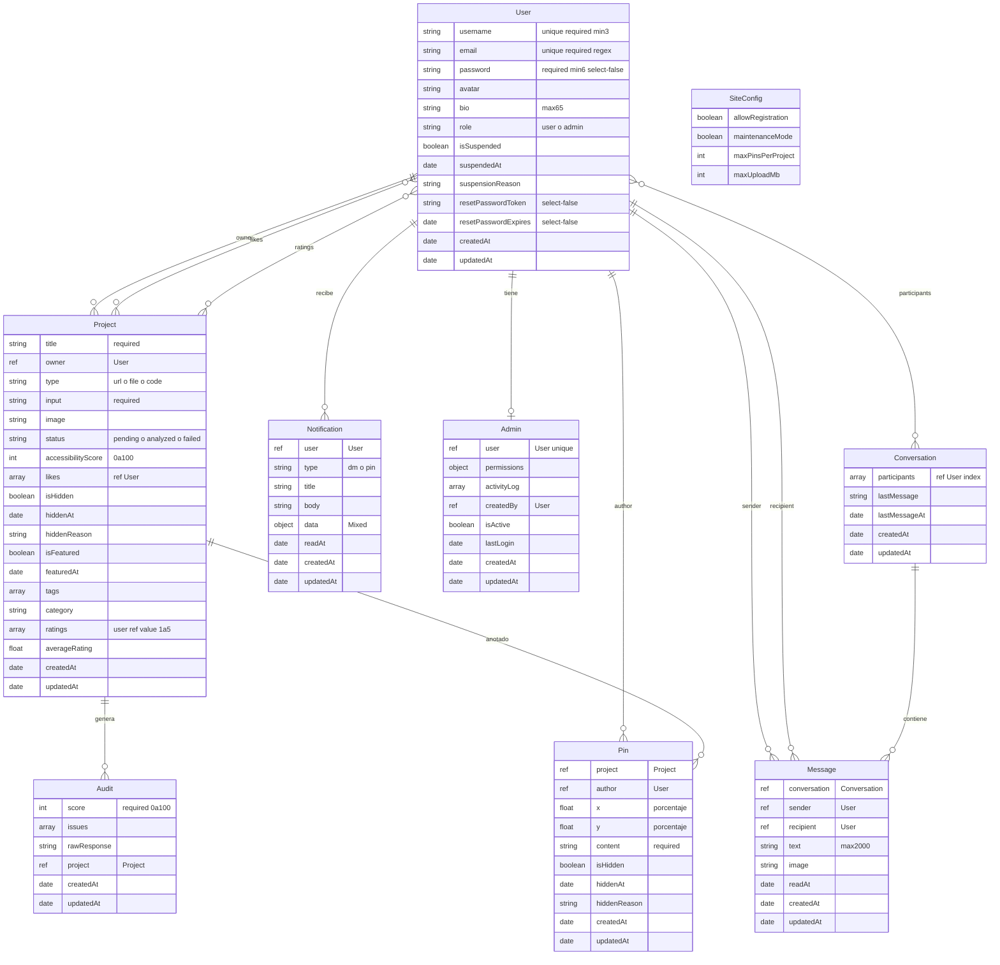

```mermaid
erDiagram
    User ||--o{ Project : "owner"
    User ||--o{ Pin : "author"
    User ||--o{ Message : "sender"
    User ||--o{ Message : "recipient"
    User ||--o{ Notification : "recibe"
    User ||--o| Admin : "tiene"
    User }o--o{ Conversation : "participants"
    User }o--o{ Project : "likes"
    User }o--o{ Project : "ratings"

    Project ||--o{ Audit : "genera"
    Project ||--o{ Pin : "anotado"

    Conversation ||--o{ Message : "contiene"

    SiteConfig {
        boolean allowRegistration
        boolean maintenanceMode
        int maxPinsPerProject
        int maxUploadMb
    }

    User {
        string username "unique required min3"
        string email "unique required regex"
        string password "required min6 select-false"
        string avatar
        string bio "max65"
        string role "user o admin"
        boolean isSuspended
        date suspendedAt
        string suspensionReason
        string resetPasswordToken "select-false"
        date resetPasswordExpires "select-false"
        date createdAt
        date updatedAt
    }

    Project {
        string title "required"
        ref owner "User"
        string type "url o file o code"
        string input "required"
        string image
        string status "pending o analyzed o failed"
        int accessibilityScore "0a100"
        array likes "ref User"
        boolean isHidden
        date hiddenAt
        string hiddenReason
        boolean isFeatured
        date featuredAt
        array tags
        string category
        array ratings "user ref value 1a5"
        float averageRating
        date createdAt
        date updatedAt
    }

    Audit {
        int score "required 0a100"
        array issues
        string rawResponse
        ref project "Project"
        date createdAt
        date updatedAt
    }

    Pin {
        ref project "Project"
        ref author "User"
        float x "porcentaje"
        float y "porcentaje"
        string content "required"
        boolean isHidden
        date hiddenAt
        string hiddenReason
        date createdAt
        date updatedAt
    }

    Conversation {
        array participants "ref User index"
        string lastMessage
        date lastMessageAt
        date createdAt
        date updatedAt
    }

    Message {
        ref conversation "Conversation"
        ref sender "User"
        ref recipient "User"
        string text "max2000"
        string image
        date readAt
        date createdAt
        date updatedAt
    }

    Notification {
        ref user "User"
        string type "dm o pin"
        string title
        string body
        object data "Mixed"
        date readAt
        date createdAt
        date updatedAt
    }

    Admin {
        ref user "User unique"
        object permissions
        array activityLog
        ref createdBy "User"
        boolean isActive
        date lastLogin
        date createdAt
        date updatedAt
    }
```
